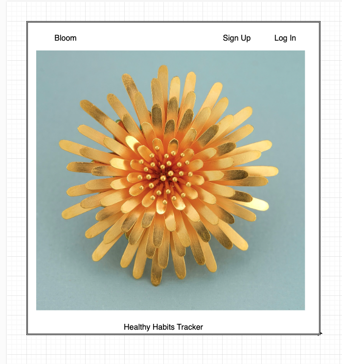

## Healthy Habits Tracker

[Github deployment] (https://github.com/suleecao/habit-tracker)

* This application lets users sign up or log in to keep track of habits. The habits themselves are split into AM and PM. Users can select whether they did or did not complete a habit for a particular day.

* Users can also edit or delete a habit, which would delete the name, status, and notes from MongoDB as well.

* The app was built on top of a MEN stack template to make sign in and sign on secure. It also uses node, EJS, JavaScript, and CSS.

**Strech Goal**
I would like to implement a calendar feature that would let users keep track of streaks for their healthy habits, as that is encouraging for them. 
